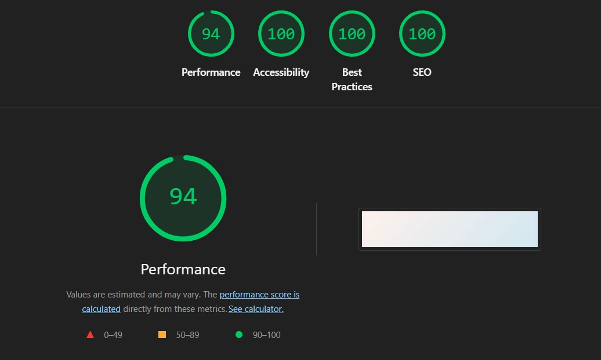
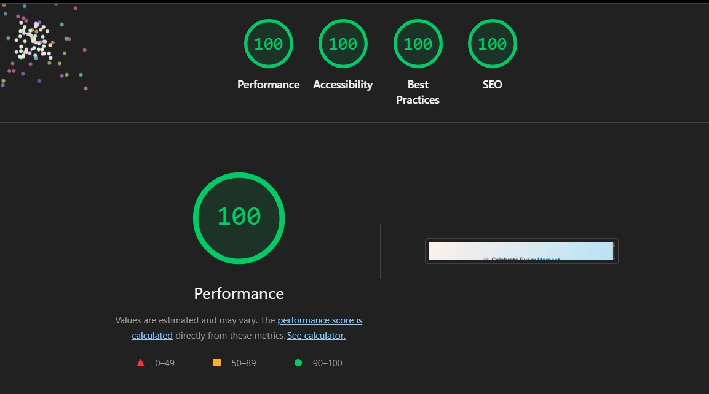

# TeamBirthdayAnniversaryTracker
A full-stack application to track birthdays, anniversaries, and milestones for your team with elegant reminders.

**Live demo:** https://team-birthday-anniversary-tracker.vercel.app/

## Table of Contents
- [About]
- [Features]
- [Tech Stack]
- [Setup & Run Instructions
- [Usage]

## About
This application helps teams celebrate birthdays, work anniversaries, and other milestones. Users can add employees, track events for today or this month, and track the number of days left for the birthdays and anniversaries.

## Features
- User authentication (signup & login)
- Add and manage employees
- View today’s and this month’s events
- Dashboard to display daily events
- Search employees by name in the directory
- Responsive UI for desktop and mobile

## Tech Stack
**Frontend:** React, React Router, CSS  
**Backend:** Node.js, Express.js  
**Database:** MongoDB Atlas  
**Authentication:** JWT, bcrypt  
**Scheduling:** node-cron for daily and monthly reminders

## Setup & Run Instructions

### Backend
1. Clone the repository:  
   ```bash
   git clone https://github.com/yourusername/birthday-anniversary-tracker.git
   cd backend

2. To install dependencies
    ```bash
    npm install

3. Added .env file that includes Mongodb atlas String, port and jwt secret token

4. Start the server
   ```bash
   node server.js
 Backend will run at http://localhost:5000.

### Frontend
5. Navigate to frontend folder
   ```bash
   cd client

6. To install dependencies
    ```bash
    npm install

7. Start the react app
   ```bash
   npm start.
  Frontend will run at http://localhost:3000.

## Usage 

1. Open the app in the browser (https://team-birthday-anniversary-tracker.vercel.app/).
2. Sign up as a new user or log in.
3. Navigate the dashboard to:
   - View **Today’s Celebrations**
   - View **This Month’s Events**
   - View Employee directory
4. Click on the Add employee to add information of employees.
5. Use the **search bar** in the dashboard to quickly find employees by their name.

## Lighthouse Performance Evidence

### Mobile
- **Performance:** 94
- **Accessibility:** 100
- **Best Practices:** 100
- **SEO:** 100



### Desktop
- **Performance:** 100
- **Accessibility:** 100
- **Best Practices:** 100
- **SEO:** 100




